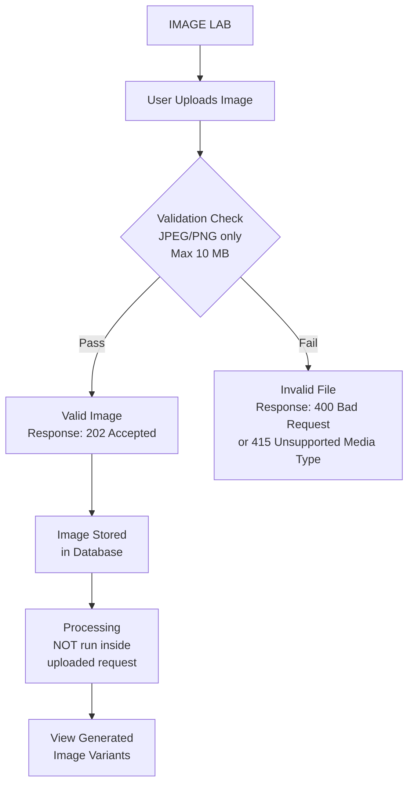
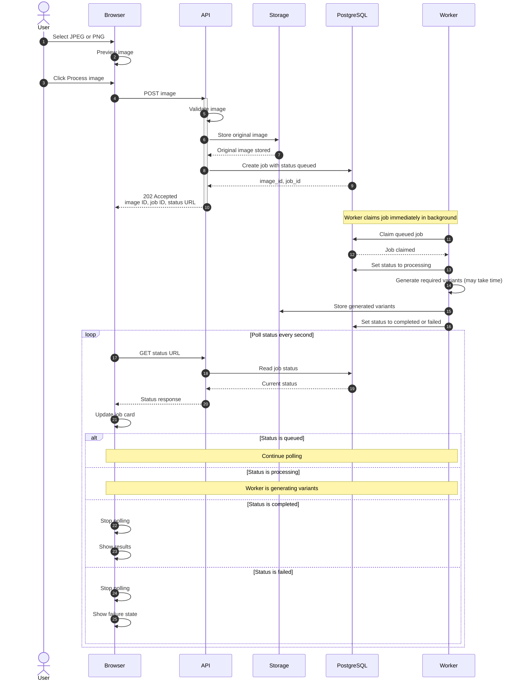
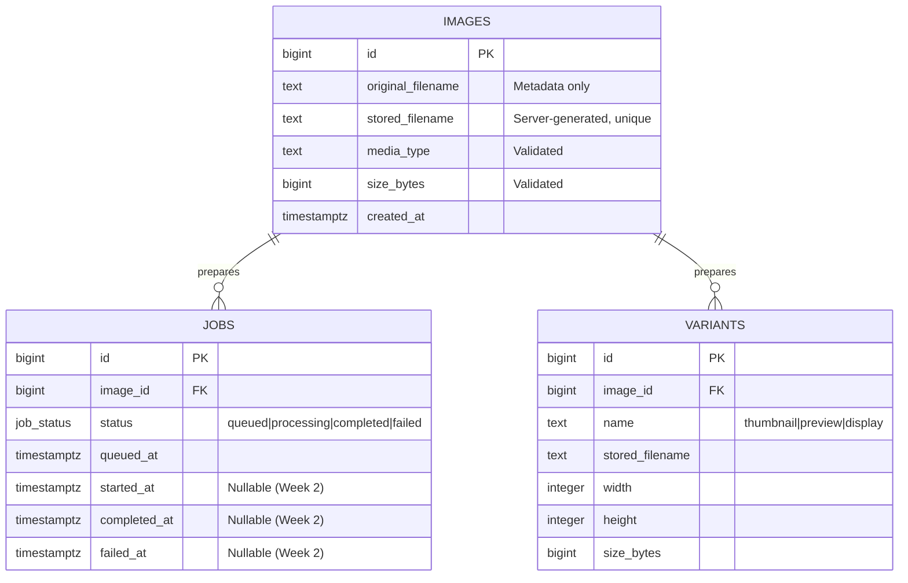
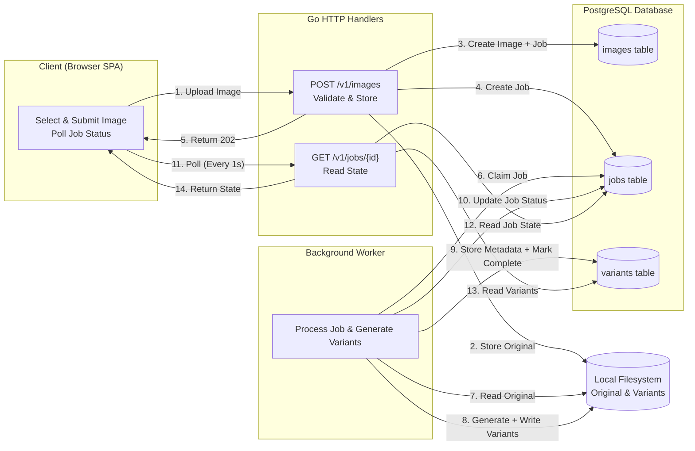

# ImageLab -- Version 1
Reynerio Samos - 2018119235

CMPS 4191 - Advanced Web Technologies - Test 1

Async 202 Accepted + Short Polling

Assessment: Build a synchronous image processing application where an API accpets work, a background worker performs processing on the image and the browser observes the job state.

**Current status: Week 1**

| Check-in | Primary Focus | Expectation | Date | Pass? | Work needed | 
|----------|---------------|-------------|------|-------|-------------|
| Week 1   | Contract, setup, schema, upload and original storage   |  Application starts; database and upload foundation work  | 9/9/2026 | Maybe | Make a disclaimer for an accepted image type, Change the UI to look more like the slides, add validation message when user uses bad file type, change ids in DB from bigserial -> UUID |
| Week 2   | | | | |  |

---

# Week 1 

## Contract, Requirements and User Flow

### Contract Description

Image lab:
- Is a single page application (SPA)
- Preserves and Exposes state through PostgreSQL

When a user selects and submits an image:
- They receive a 202 Accepted
- Later view generated image varients

Image Processing must:
- NOT run inside upload request

##### Contract Flowchart


#### API Contract: POST /v1/images

| Aspect                | Rule / Specification                                                                 |
|-----------------------|--------------------------------------------------------------------------------------|
| **Method & Path**     | `POST /v1/images`                                                                    |
| **Content-Type**      | `multipart/form-data` (Single image file)                                            |
| **Validation Rules**  | Server must accept JPEG/PNG. Server must enforce maximum size of 10 MB.              |
| **Success Response**  | `202 Accepted`                                                                       |
| **Rejection Response**| `400 Bad Request` or `415 Unsupported Media Type` (No job created)                    |

### Requirements (Only Focusing on WeeK 1 Requirements)
1. Core Architecture & Scope
- ARC-01: Backend must be a Go HTTP API with one in-process background worker.
- ARC-02: Database must be PostgreSQL for images, jobs, and variant metadata.
- ARC-03: File storage must be the local filesystem for original and generated images.
- ARC-04: The core pattern is 202 Accepted + Persistent Job + One Worker + Short Polling.
- ARC-05: Image processing MUST NOT run inside the HTTP upload request.

2. API Contract (HTTP & JSON)
- API-01: Endpoint `POST /v1/images` receives one image via multipart/form-data.
- API-02: Before returning 202, the handler must: validate upload → store original → create image record → create queued job.
- API-03: The request handler must not generate variants.
- API-04: Success must return HTTP 202 Accepted with:
  - Location:` /v1/jobs/{job_id} header.`
  - JSON body: `{ "image_id": 108, "job_id": 42, "status": "queued", "status_url": "/v1/jobs/42" }`
- API-05: `GET /v1/jobs/{job_id}` returns current job state and completed variant metadata.
- API-06: `GET /v1/images/{image_id}/variants/{name}` returns one known generated variant

4. Upload Validation & Storage (Week 1)
- VAL-01: Accept JPEG and PNG images no larger than 10 MB.
- VAL-02: Server must enforce type, size, presence, and decodability.
- VAL-03: Generate server-controlled stored filenames. Never use the submitted filename directly as a filesystem path.
- VAL-04: Original filename may be stored as display metadata only.
- VAL-05: If validation, storage, or record creation fails, do not return 202 and do not claim a job exists.

---

### User Flow


---

## Database Schema


## Main Architecture Diagram


### Component Responsibilities

| Component | Responsibilities |
| :--- | :--- |
| **Browser (SPA)** | Select & preview image, send one POST request, short-poll `GET /v1/jobs/{id}` every 1 second, render results/failures. |
| **HTTP API** | Validate (JPEG/PNG, ≤10MB), generate safe stored filename, write original to FS, create `images` + `jobs` (queued) records, return `202 Accepted` with status URL. |
| **Background Worker** | Claim `queued` job via transaction + row locking, read original from FS, generate `thumbnail`, `preview`, `display` variants, write files, insert `variants` metadata, mark job `completed` or `failed`. |
| **PostgreSQL** | Authoritative state: `images` (metadata), `jobs` (status + timestamps), `variants` (dimensions + paths). |
| **Local Filesystem** | Stores original uploads and generated variant files using server-controlled unique names. |

---

## Prerequisites and Setup

- Go Version 1.22
- PostgreSQL
- The `migrate` CLI (`golang-migrate`):
  ```bash
  go install -tags 'postgres' github.com/golang-migrate/migrate/v4/cmd/migrate@latest
  ```
- Web browser able to open HTML pages

### Setup

1. Create a database and user:
   ```bash
   sudo -u postgres psql -c "CREATE USER imagelab WITH PASSWORD 'imagelabpass';"
   sudo -u postgres psql -c "CREATE DATABASE imagelab OWNER imagelab;"
   ```

2. Copy the environment template and edit it if your credentials differ:
   ```bash
   cp .envrc.example .envrc
   source .envrc
   ```

3. Apply migrations:
   ```bash
   migrate -path ./migrations -database "$IMAGELAB_DB_DSN" up
   ```

4. Fetch dependencies:
   ```bash
   go mod tidy
   ```

5. Run the server:
   ```bash
   go run ./cmd/api -db-dsn="$IMAGELAB_DB_DSN"
   ```

6. Open the app:
   ```
   http://localhost:4000
   ```


---
